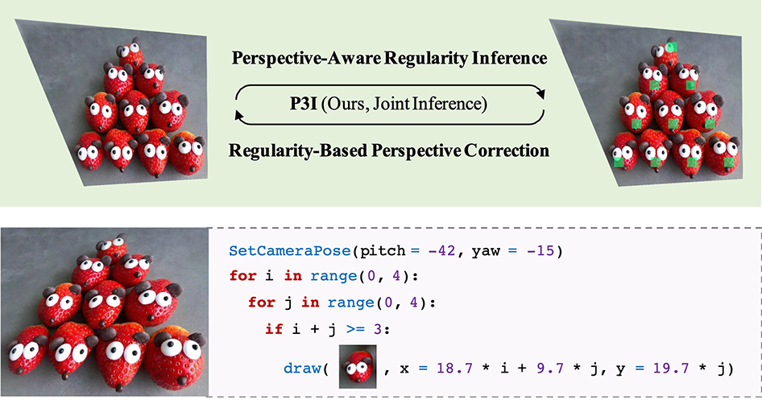

# P3I - Perspective Plane Program Induction
This repository contains the official implementation of the paper: 

<div align="center">
  
</div>

**[Perspective Plane Program Induction from a Single Image
](http://p3i.csail.mit.edu/data/paper/2020CVPR-P3I.pdf)**
<br />
[Yikai Li](https://www.instagram.com/42x00/?hl=en)\*,
[Jiayuan Mao](http://jiayuanm.com)\*, 
[Xiuming Zhang](http://people.csail.mit.edu/xiuming/), 
[William T. Freeman](http://billf.mit.edu/),
[Joshua B. Tenenbaum](https://web.mit.edu/cocosci/josh.html), and
[Jiajun Wu](https://jiajunwu.com/)
<br />
In Computer Vision and Pattern Recognition (CVPR) 2020
<br />
[[Paper]](http://p3i.csail.mit.edu/data/paper/2020CVPR-P3I.pdf)
[[Project Page]](http://p3i.csail.mit.edu/)
[[BibTex]](http://nscl.csail.mit.edu/data/bibtex/2019ICLR-NSCL.bib)

```
@inproceedings{Li2020Perspective,
	title={{Perspective Plane Program Induction from a Single Image}},
	author={Li, Yikai and Mao, Jiayuan and Zhang, Xiuming and Freeman, William T. and Tenenbaum, Joshua B. and Wu, Jiajun},
	booktitle={Conference on Computer Vision and Pattern Recognition},
	year={2020}
}
```


### Introduction

[P3I](http://p3i.csail.mit.edu/data/paper/2020CVPR-P3I.pdf) is a conceptually simple yet effective algorithm for inducing neuro-symbolic, program-like representation from a single image. 


### Installation

For the ease of reproducibility, you are suggested to install [miniconda](https://docs.conda.io/en/latest/miniconda.html) (or [anaconda](https://www.anaconda.com/distribution/) if you prefer) before executing the following commands. 

```bash
git clone https://github.com/42x00/p3i
cd p3i
conda create -y -n p3i
source activate p3i
# Replace cudatoolkit=10.1 with your CUDA version: https://pytorch.org/
conda install -y pytorch cudatoolkit=10.1 -c pytorch
conda install -y pillow opencv
```

### QuickStart
To quickly test P3I on a given image, you can execute

```Bash
python demo.py --input assets/demo.png
```

The induced program and rectified image will be saved to the results folder.

### Pre-trained Models
You can download our reference pre-trained models from [Google Drive](https://drive.google.com/file/d/1J3giL8J2rV9Ddq-zpDlGk8anoTrasdG2/view?usp=sharing). This model was trained on ImageNet by Krizhevsky et al. 2012. We use it to extract visual features from the given image to make the inference procedure more robust.

### Induce Program for Your Own Images
To perform P3I on your own images, you need to execute

```Bash
python demo.py --device 0 --model_ckpt <path-to-pretrained-model> --input <path-to-image> --output_dir <path-to-output>
```
Here, `--device 0` is specifying the GPU ID used for induction, and you can skip it to use CPU.


